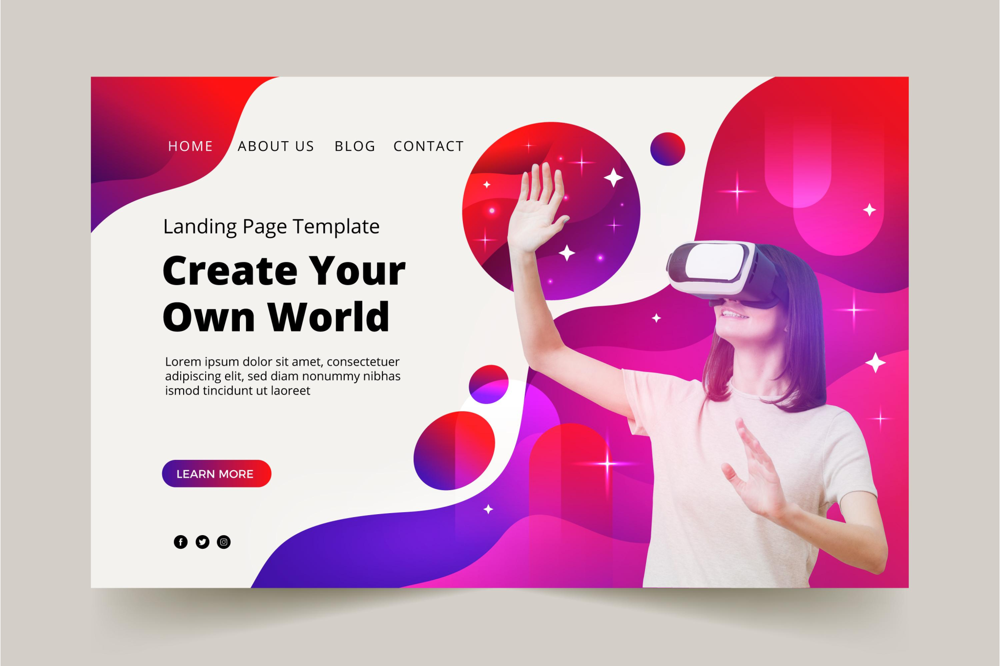

 
  
# Portfólio de **Mateus Mendes**

## Sobre Mim
Sou um freelancer em design **UI/UX** e desenvolvimento web, baseado em **Londres, Inglaterra**. Busco criar aplicações web imersivas e belas por meio de código cuidadosamente elaborado e design centrado no usuário.

## Processo de Trabalho
Neste portfólio, demonstro minhas habilidades e competências em um ambiente de trabalho:

- **Pesquisa:** Experiência em pesquisar informações sobre determinados assuntos.
- **Análise:** Especializado em análise de informações e dados.
- **Design:** Graduado em design e experiência na criação de páginas.
- **Trabalho em Equipe:** Bom trabalho em equipe e boa comunicação com o time.

## Portfolio
Projetos fictícios nos quais ainda estou em treinamento:

### Landing Page
**Descrição:** Design UI/UX  
  
[Ver Estudo de Caso](#)

### Blog
**Descrição:** Design UI/UX  
  
[Ver Estudo de Caso](#)

### E-commerce
**Descrição:** Design UI/UX  
  
[Ver Estudo de Caso](#)

### Sport
**Descrição:** Design UI/UX  
  
[Ver Estudo de Caso](#)

### Apps
**Descrição:** Design UI/UX  
  
[Ver Estudo de Caso](#)

### Product Admin Dashboard
**Descrição:** Design UI/UX  
  
[Ver Estudo de Caso](#)

## Contato
Se você tem um projeto, vamos discutir! Sou proficiente em empreendimentos colaborativos, excelentes em ambientes de equipe, promovendo comunicação fluida e sinergia.

- **E-mail:** mateusm.jacubavicius@gmail.com
- **LinkedIn:** [Mateus Mendes](#)
  
## Redes Sociais
Siga-me nas redes sociais:
- [Instagram](#)
- [LinkedIn](#)
- [Twitter](#)
- [WhatsApp](#)

## Rodapé
© 2024 **Mateus Mendes** - Todos os direitos reservados || Design por: **Mendes**
